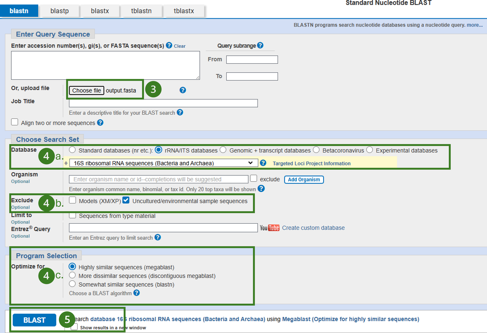
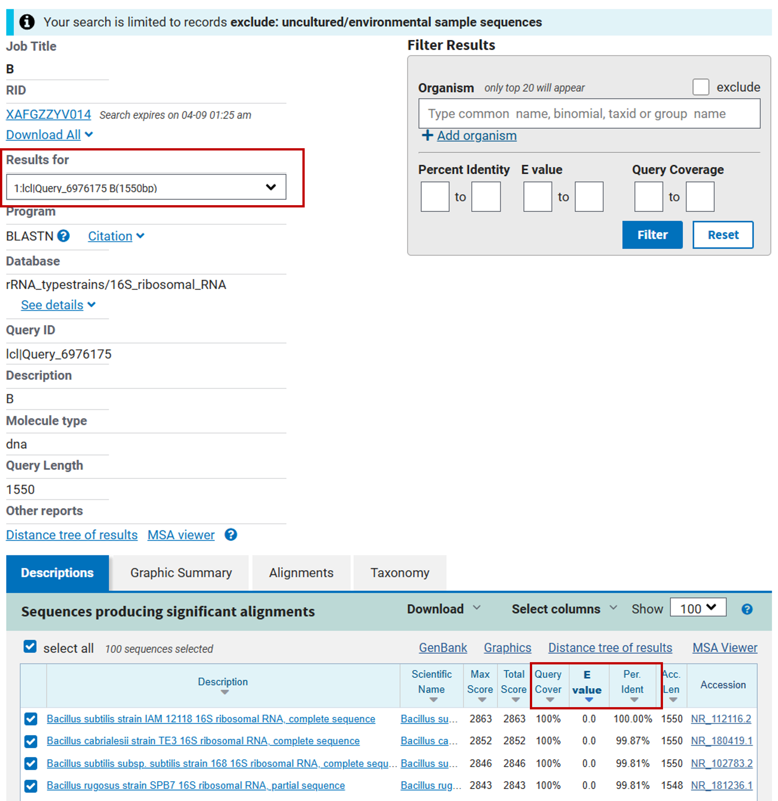

# Script pour BLAST

Maintenant que vous vous êtes familiarisés avec les différentes commandes R et l'interface de RStudio, vous êtes maintenant prêtes et prêts à utiliser R pour obtenir les séquences d'ADN de vos inconnus. Ces dernières ont été compilées dans un seul fichier en format CSV (`inconnus_equipe.csv`) pour l'ensemble des étudiants de la classe. Vous devez donc utiliser des filtres afin d'extraire uniquement vos données. 

## Script R 

### Importer le jeu de données 

La première étape consiste à importer le fichier `inconnus_equipe.csv` dans R avec la commande suivante :  

```{r, eval = FALSE}
df_raw = read.csv("https://raw.githubusercontent.com/karinevilleneuve/BIA1401_2026/refs/heads/main/inconnus_equipe.csv", header = TRUE)
```

### Filtrer les données 

La prochaine étape consiste à filtrer les colonnes appropriées du tableau de données afin d'extraire vos données.  Pour ce faire, n'hésitez pas à consulter les exemples de la section précédente ([Exploration de données]), rechercher sur internet, ou demander à vos démos. 

Pour afficher les solutions possibles, cliquer sur " ▶ Code " ci-dessous.


```{r, eval = FALSE, class.source="fold-hide"}
# Solution 1 - Utiliser la fonction native subset() de R  
df_sub = subset(df_raw, Laboratoire == "Jeudi" & Equipe_ID == "12")

# Solution 2 - Utiliser la librairie dplyr avec la fonction filter() 
library(dplyr)
df_sub = df_raw %>%
  filter(Laboratoire == "Jeudi" & 
           Equipe_ID == "12")
```


Si tout fonctionne, vous devriez maintenant voir un second objet `df_sub` comportant 3 lignes et 7 colonnes.

### Exporter en format FASTA 

Nous allons maintenant enregistrer sous format **FASTA** le tableau de données filtré afin de pouvoir le téléverser vers l'outil BLAST du NCBI. 

En bio-informatique, le format FASTA est un fichier de texte lisible (et non un format binaire) qui contient des séquences d'acides nucléiques (ADN/ARN) ou acides aminées (protéines). Chaque séquence débute par une ligne d’en-tête, introduite par le symbole « > ». Les lignes suivantes contiennent la séquence elle-même, écrite sous forme d’une succession de lettres correspondant aux nucléotides ou aux acides aminés. Par convention, les séquences sont souvent présentées sur des lignes de 80 caractères ou moins, ce qui facilite leur lecture. 

Exemple de fichier FASTA : 

```
>Escherichia_coli_16S
AGAGTTTGATCCTGGCTCAG
GATGAACGCTGGCGGCGTGC
CTAATACATGCAAGTCGAGC
```

Il n’existe pas de fonction native dans R permettant la création ou la manipulation de fichiers FASTA. Il faut donc utiliser la librairie spécialisée [seqinr](https://www.rdocumentation.org/packages/seqinr/versions/4.2-36). Les premières étapes consistent donc à installer cette librairie (`install.packages("seqinr")`), puis à la charger dans l’environnement de travail (`library(seqinr)`).

Description des paramètres de la fonction `write.fasta()` : 

- `sequences = ` : indique la colonne du tableau contenant les séquences ;
- `names = ` : indique la colonne contenant les identifiants à utiliser pour les en-têtes des séquences ; 
- `nbchar = ` : indique le nombre de caractères par ligne doit ête accompagné du paramètre ;
- `as.string =` : spécifie que les séquences sont fournies sous forme de chaînes de caractères ;
- `file.out = ` : indique le nom qu'on veut donner au fichier à produire.  


```{r, eval = FALSE}
install.packages("seqinr")  
library(seqinr)

write.fasta(sequences = as.list(df_sub$Sequence), 
            names = df_sub$Inconnu_ID, 
            nbchar = 80, as.string = TRUE, 
            file.out = "output.fasta")
```

## Utiliser BLAST 

1. Rendez-vous sur l'outil en ligne [BLAST du NCBI](https://blast.ncbi.nlm.nih.gov/Blast.cgi)  
2. Choisir l'analyse `Nucleotide BLAST` (`BLASTn`) 
3. Sélectionner `Choose file` et sélectionner le fichier produit (`output.fasta`)
4. Modifier **les paramètres de la recherche BLAST**

    - a. Utiliser la collection de nucléotides (Database rRNA/ITS database)
    - b. Exclure les organismes environnementaux et non cultivés(Exclude Uncultured/environmental sample sequences)
    - c. Choisir l'algorithme de BLAST désiré (essayer à la fois les algorithmes` BLASTn` et` MegaBLAST`
  
5. Lancer l'analyse (bouton `BLAST`). 

```{r echo=FALSE, out.width = "100%", fig.align = "center", out.lenght = "100%"}

```

Exemple de résultat : 

Pour voir les résultats de vos autres inconnus utiliser le menu déroulant sous l'encadré **Results for**

```{r echo=FALSE, out.width = "70%", fig.align = "center", out.lenght = "100%"}

```

6. Pour votre rapport, vous devez inclure un imprime-écran incluant les trois premiers résultats de l’analyse (trois premiers taxons identifiés) pour chacun de vos inconnus. Vous devez inclure cette image dans l’annexe de votre travail et pour le corps du texte produire un tableau comprenant les colonnes suivantes : 
  - Per. Ident. 
      - La proportion de nucléotides identiques entre votre séquence et la séquence trouvée dans la base de données, dans la région alignée
  - Query cover
      - Le pourcentage de votre séquence inconnue qui a été aligné avec la séquence de la base de données
  - E.value
      - Estime le nombre de résultats similaires que l’on pourrait obtenir par hasard
  
Vous pouvez aussi consulter pour votre plaisir personnel : 

- L’arbre phylogénétique (Distance tree of results) 
- Les résultats de l'alignement (MSA viewer)

